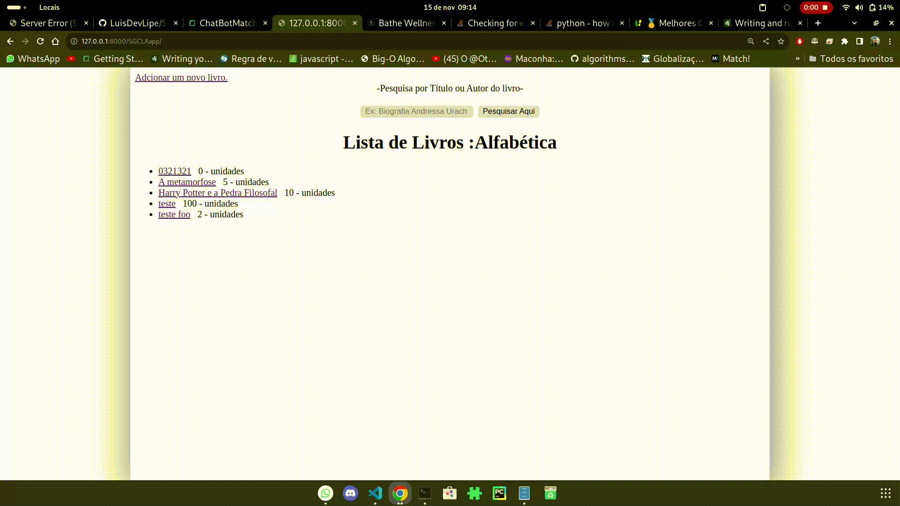

# SGCLA
Sistema de Gerenciamento e Controle de Livros Alugados
Projeto Final do Módulo do Programa Match! da MasterTech.
# A aplicação pode ser vista em.
https://sgcla.onrender.com/SGCLAapp/
```
    nota importante, devido a implementação do gunicorn os arquivos estáticos não estão sendo servidos na página ainda, um outro pacote como nginx deverá ser utilizado no lugar do gunicorn.
    nota 2 : o erro ao adcionar um livro com 0 unidades levanta server error (500).
```


Projeto: Catálogo de livros com Verificação de disponibilidade.
Objetivo:
O aluno irá criar um catálogo de livros em Python. A aplicação incluirá as seguintes etapas.

> Cadastro de Livros.
  - Os usuários poderão cadastrar livros, incluindo título, autor e número de exemplares disponíveis.
> Validação de disponibilidade.
  - A aplicação verificará se o número de exemplares disponíveis é um valor válido e maior que 0.
> Pesquisa de livros.
  - Os usuários poderão pesquisar livros por título ou autor.
  - A aplicação exibirá os resultados da pesquisa e a disponibilidade de cada livro.

Entregue:

Banco de dados sqlite3 contendo 3 tabelas: livro que contém título, autor, ano de publicação, editora, genero e quantidade de unidades disponíveis;
usuario que contém primeiro nome, segundo nome, data de nascimento;
livrosAugados que contém data do empréstimo, data da devolução e um campo para observações ( ex: Livro com capa rasgada na data de empréstmo ).

Serviço web hospedando a aplicação.

Aplicação em Pyhon utilizando o framework Django, como indicado no material do curso.

Página inicial com uma lista inicial de livros e um formulário de pesquisa por autor e título. A busca gera uma nova lista na página inicial.

Página para adconar um novo livro.

Página contendo detalhes de um livro específico.
As listas da página inicial e busca podem ser usadas como links diretos para a página de detalhes.

Ao adcionar um livro com unidades = 0 ou < 0 a plicação deve lançar um erro do tipo ValueError com a mensagem de que não é possível adcionar um livro com unidades igual ou menor que 0.

Extra...
  Existe uma tabela de livros alugados que liga livros e usuários atraveés de uma relação muitos para muitos.
  é possível através do painel de administrador do Django na rota /admin/SGCLAapp/
  adcionar usuários e adcionar no banco de dados um empréstimo no nome de um usuário.

  É esperado que a págna de detalhes apresente a quantidade total de unidades, a quantidade disponível e uma tabela com o nome do usuário e as informaões do empréstimo.

  OBS... Não é esperado empréstimos acima da quantidade de unidades disponíveis. Ex: 7 usuários possuem o livro "As crônicas de Nárnia" emprestado, enquanto o mesmo possui somente 5 unidades disponíveis. Esta ação pode quebrar a aplicação...
  Este problema ainda deve ser resolvido. Esteja ciente avaliador o extra contém bugs para serem corrigidos.
  
# Vídeo de Demonstração.

  
  
